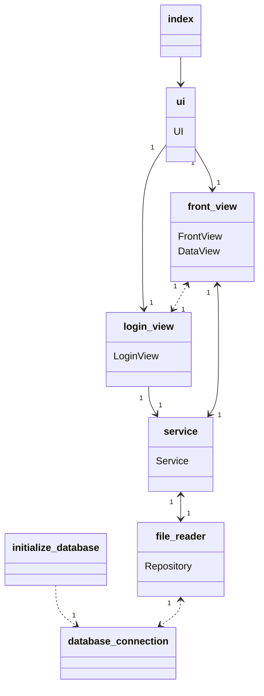
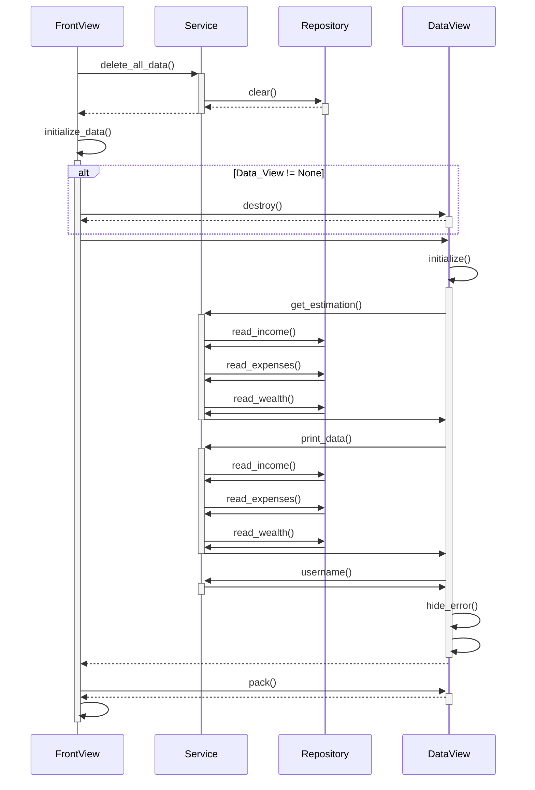
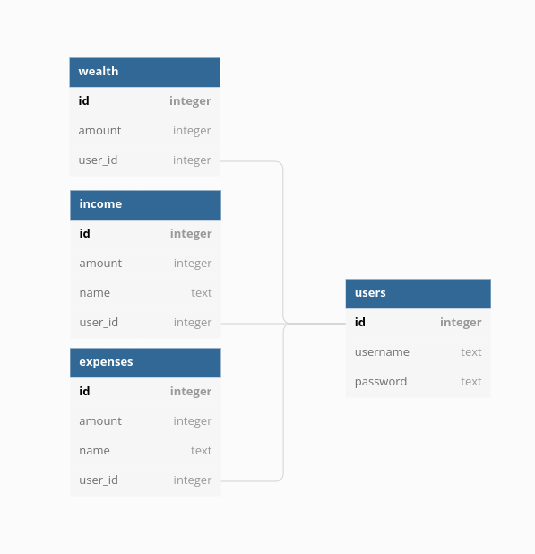

## rakenne

Sovelluksen rakenne koostuu käyttöliittymästä, sovelluslogiikasta ja repositoriosta. Sovelluksen käynnistyessä index-moduuli alustaa luokat Repository ja Service, sekä luo ikkunan sovellukselle tkinter:illa. Käyttöliittymästä huolehtii Service. SQL-repositorion kanssa kommunikoi luokka Repository, joka saa SQL-repositorion sijainnin moduulista database_connection. Initialize_database alustaa SQL-repositorion.

## sovelluslogiikka

Suuri osa sovelluksen toiminnoista noudattaa seuraavaa kaavaa.  
tietojen poistaminen repositoriosta:  

Käyttäjä painaa Päänäkymässä olevaa nappia "poista kaikki tiedot". Luokka FrontView kutsuu Servicen funktiota delete_all_data(), joka taas kutsuu file_reader moduulissa sijaitsevan Repository-luokan moduulia clear(). Clear poistaa SQL tauluista käyttäjän antaman datan ja palaa taas Servicen kautta FrontView-luokkaan. Seuraavaksi on päivitettävä päänäkymä, jotta muutokset välittyvät käyttäjälle. FrontView kutsuu funktiota initialize_data(). Ensin funktio tuhoaa vanhentuneen näkymän kutsumalla DataView-luokan funktiota destroy(). Sitten se alkaa rakentaa uutta näkymää luomalla uuden DataView-olion. Olion luonnissa DataView kutsuu funktiona initialize(), joka pyytää Servicen ja Repositorion kautta viimeisimmät tiedot SQL tauluista. Tietojen haun jälkeen poistetaan vielä mahdolliset virheviestit näytöltä ja palataan FrontView-luokkaan. FrontView kutsuu vielä DataView:n pack()-funktiota, joka viimeistelee tietojen generoimisen päänäkymään.

## tallennus

Data tallennetaan SQLite-tietokantaan (harjoitustyo/src/repositories/data.db). Tietokantaa lukee ja kirjoittaa File_reader.py moduulissa oleva Repository-luokka. Tietokannan schema on tallennettu schema.sql tiedostoon. Tietokannassa on taulut income, expenses, wealth ja users.  

