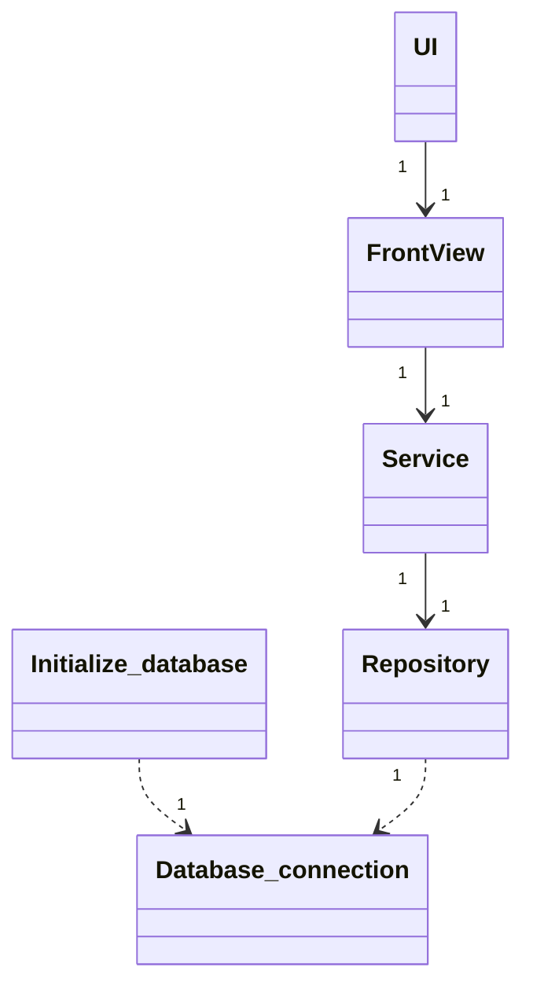
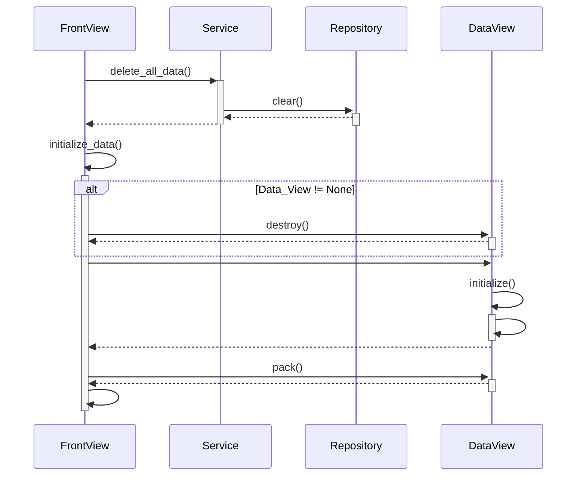

sovellus:

```mermaid
 classDiagram
      Service "1" --> "1" Repository
      Initialize_database ..> "1" Database_connection
      Repository "1" ..> "1" Database_connection
      UI "1" --> "1" FrontView
      FrontView "1" --> "1" Service
```

tietojen poistaminen repositoriosta: 

```mermaid
sequenceDiagram
    FrontView->>+Service: delete_all_data()
    Service->>+Repository: clear()
    Repository-->>-Service: 
    Service-->>-FrontView: 
    FrontView->>+FrontView: initialize_data()
    alt Data_View != None
        FrontView->>+DataView: destroy()
        DataView-->>-FrontView: 
    end
    FrontView->>DataView: 
    DataView->>+DataView: initialize()
    DataView->>-DataView: 
    DataView-->>FrontView: 
    FrontView->>+DataView: pack()
    DataView-->>-FrontView: 
    FrontView->>-FrontView: 
```
