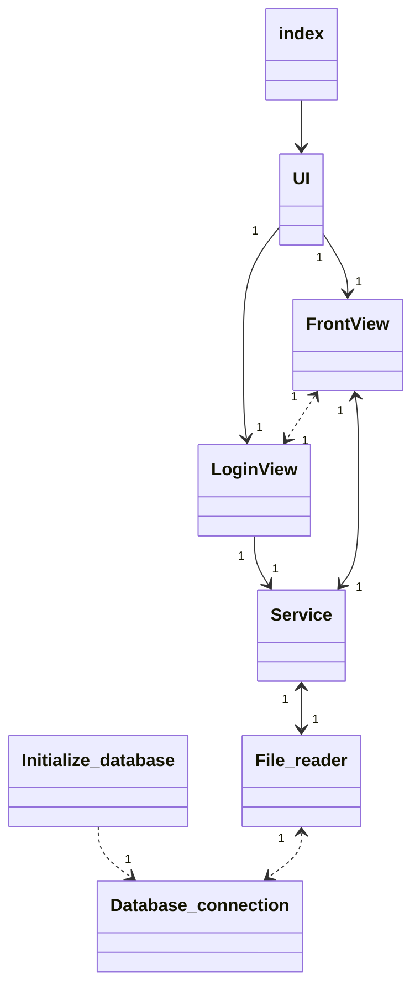
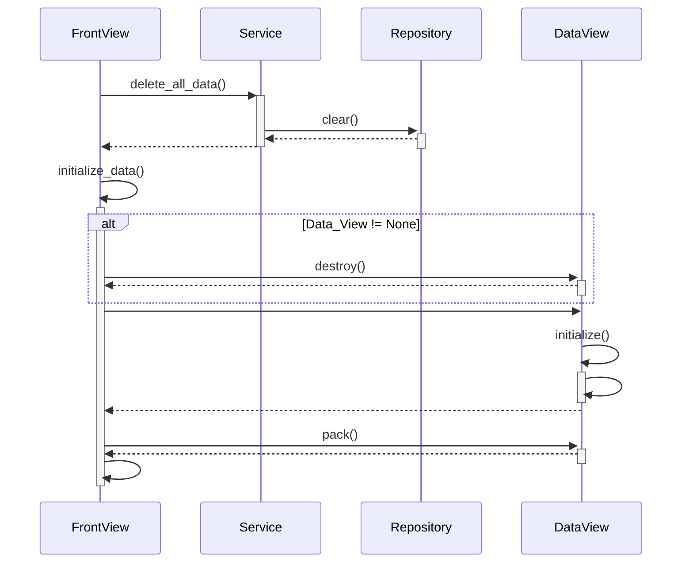

## rakenne

## sovelluslogiikka

Suuri osa sovelluksen toiminnoista noudattaa seuraavaa kaavaa.  
tietojen poistaminen repositoriosta: 

## tallennus

Data tallennetaan SQLite-tietokantaan (harjoitustyo/src/repositories/data.db). Tietokantaa lukee ja kirjoittaa File_reader.py tiedostossa oleva Repository -luokka. Tietokannan schema on tallennettu schema.sql tiedostoon. Tietokannassa on taulut income, expenses, wealth ja users.