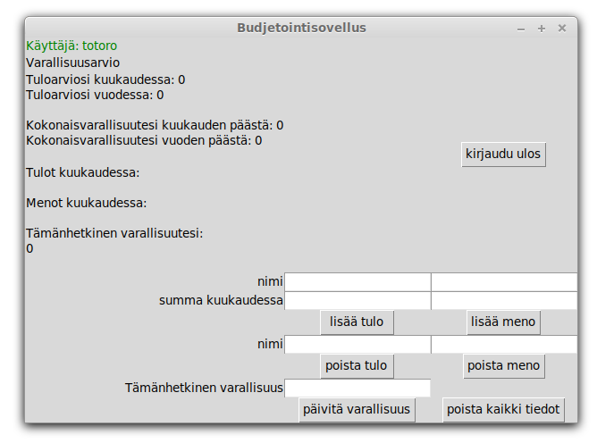

## kirjautuminen

Sovelluksen käynnistyessä ensimmäinen näkymä on kirjautumisnäkymä. Rekisteröityminen tapahtuu samasta näkymästä. Ylempään tekstikenttään kirjoitetaan käyttäjätunnus ja alempaan salasana. Jos käyttäjää ei ole vielä olemassa, panetaan rekisteröidy, muutoin painetaan kirjaudu.  

## sovelluksen käyttäminen

Kirjautumisen jälkeen näkyviin tulee sovelluksen päänäkymä. Ylälaidassa näkyy käyttäjätunnus, ja sen alapuolella annettujen tietojen perusteella luotu arvio.  

### tietojen hallinta

Alalaidassa käyttäjä voi lisätä itselleen menoja, tuloja ja varallisuutta, sekä poistaa niitä. Ensin käyttäjä antaa tekstikenttiin haluamansa tiedot ja sen jälkeen painaa tekstikentän alapuolella olevaa painiketta, jolloin tiedot päivittyvät sivulle.  

### uloskirjautuminen

Uloskirjautuminen tapahtuu päänäkymän oikeassa laidassa olevasta napista.