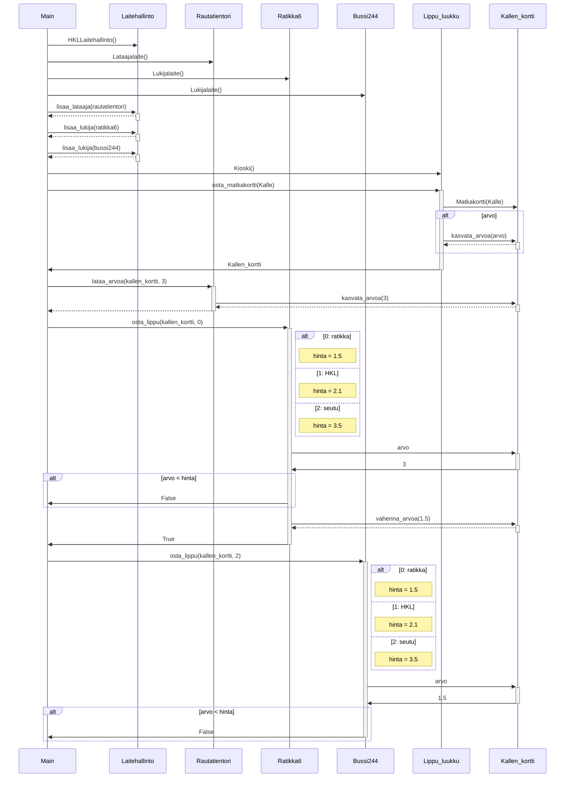

```mermaid
sequenceDiagram
    Main->>Laitehallinto: HKLLaitehallinto()
    Main->>Rautatientori: Lataajalaite()
    Main->>Ratikka6: Lukijalaite()
    Main->>Bussi244: Lukijalaite()
    Main->>+Laitehallinto: lisaa_lataaja(rautatientori)
    Laitehallinto-->>-Main: 
    Main->>+Laitehallinto: lisaa_lukija(ratikka6)
    Laitehallinto-->>-Main: 
    Main->>+Laitehallinto: lisaa_lukija(bussi244)
    Laitehallinto-->>-Main: 
    Main->>Lippu_luukku: Kioski()
    Main->>+Lippu_luukku: osta_matkakortti(Kalle)
    Lippu_luukku->>Kallen_kortti: Matkakortti(Kalle)
    alt arvo
        Lippu_luukku->>+Kallen_kortti: kasvata_arvoa(arvo)
        Kallen_kortti-->>-Lippu_luukku: 
    end
    Lippu_luukku->>-Main: Kallen_kortti
    Main->>+Rautatientori: lataa_arvoa(kallen_kortti, 3)
    Rautatientori->>+Kallen_kortti: kasvata_arvoa(3)
    Kallen_kortti-->>-Rautatientori: 
    Rautatientori-->>-Main: 

    Main->>+Ratikka6: osta_lippu(kallen_kortti, 0)
    alt 0: ratikka
        Note right of Ratikka6: hinta = 1.5
    else 1: HKL
        Note right of Ratikka6: hinta = 2.1
    else 2: seutu
        Note right of Ratikka6: hinta = 3.5
    end
    Ratikka6->>+Kallen_kortti: arvo
    Kallen_kortti->>-Ratikka6: 3
    alt arvo < hinta
        Ratikka6->>Main: False
    end
    Ratikka6->>+Kallen_kortti: vahenna_arvoa(1.5)
    Kallen_kortti-->>-Ratikka6: 
    Ratikka6->>-Main: True

    Main->>+Bussi244: osta_lippu(kallen_kortti, 2)
    alt 0: ratikka
        Note right of Bussi244: hinta = 1.5
    else 1: HKL
        Note right of Bussi244: hinta = 2.1
    else 2: seutu
        Note right of Bussi244: hinta = 3.5
    end
    Bussi244->>+Kallen_kortti: arvo
    Kallen_kortti->>-Bussi244: 1.5
    alt arvo < hinta
        Bussi244->>-Main: False
    end
```