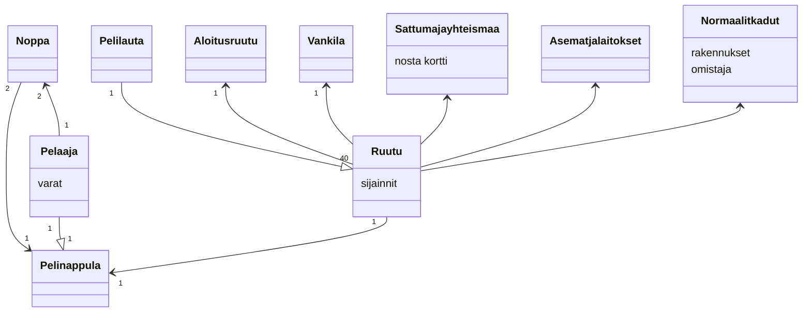

```mermaid
 classDiagram
      Noppa "2" <-- "1" Pelaaja
      Noppa "2" --> "1" Pelinappula
      Pelaaja "1" --|> "1" Pelinappula
      Pelilauta "1" --|> "40" Ruutu
      Ruutu "1" --> "1" Pelinappula
      Aloitusruutu "1" <-- Ruutu
      Vankila "1" <-- Ruutu
      Sattuma ja yhteismaa <-- Ruutu
      Asemat ja laitokset <-- Ruutu
      Normaalit kadut <-- Ruutu
      class Noppa{

      }
      class Pelaaja{
          varat
      }
      class Pelilauta{

      }
      class Ruutu{
          sijainnit
      }
      class Pelinappula{

      }
      class Aloitusruutu{
          
      }
      class Vankila{

      }
      class Sattuma ja yhteismaa{
          nosta kortti
      }
      class Asemat ja laitokset{

      }
      class Normaalit kadut{
          rakennukset
          omistaja
      }
```
