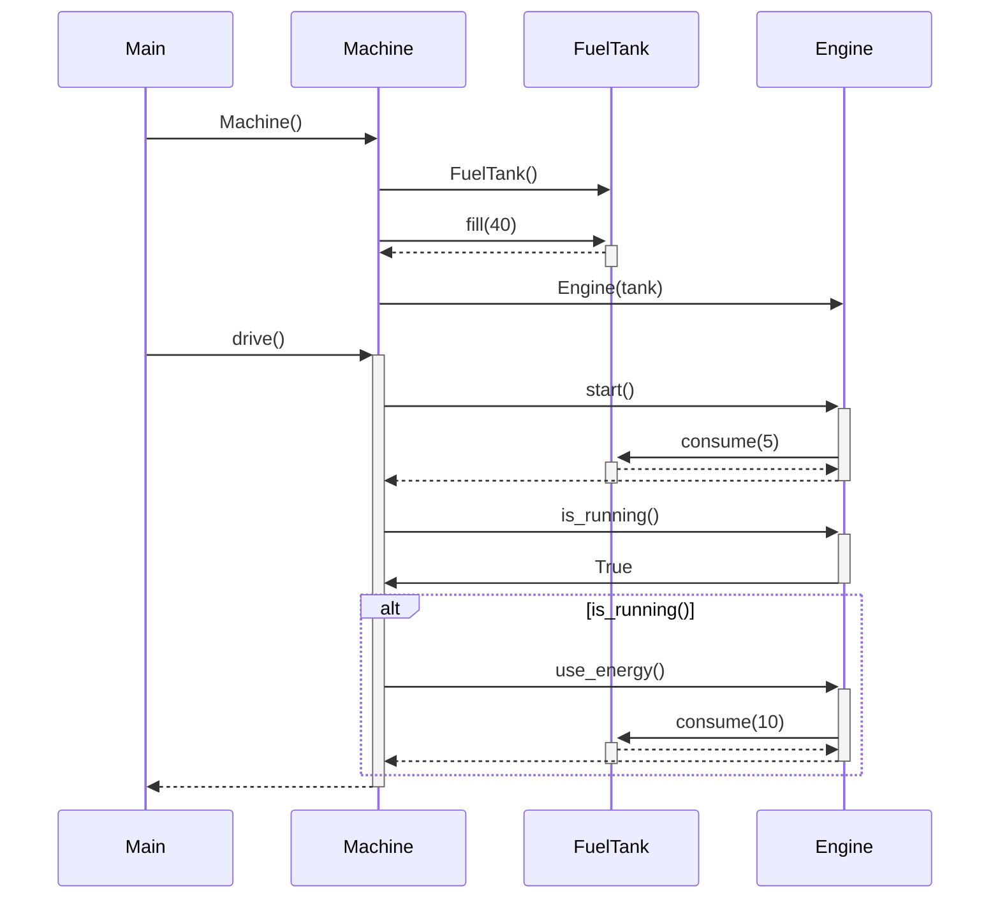

```mermaid
sequenceDiagram
    Main->>Machine: Machine()
    Machine->>FuelTank: FuelTank()
    Machine->>+FuelTank: fill(40)
    FuelTank-->>-Machine: 
    Machine->>Engine: Engine(tank)
    Main->>+Machine: drive()
    Machine->>+Engine: start()
    Engine->>+FuelTank: consume(5)
    FuelTank-->>-Engine: 
    Engine-->>-Machine: 
    Machine->>+Engine: is_running()
    Engine->>-Machine: True
    alt is_running()
        Machine->>+Engine: use_energy()
        Engine->>+FuelTank: consume(10)
        FuelTank-->>-Engine: 
        Engine-->>-Machine: 
    end
    Machine-->>-Main: 
```